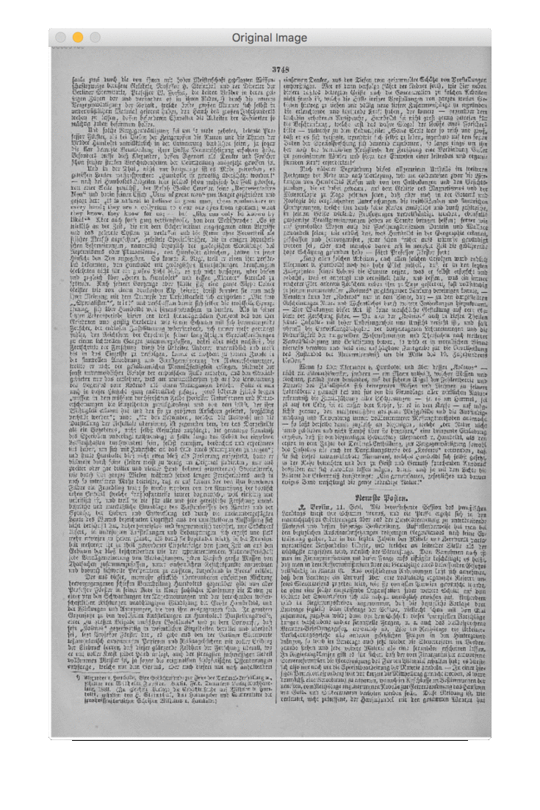

# Docstrum Algorithm
## Getting Started
This repo is for developing a Docstrum algorithm presented by O’Gorman (1993).

## Disclaimer
This source code is built on top of the work by Chadoliver. Please find the original code from here (https://github.com/chadoliver/cosc428-structor).

## Objective
This project aims at segmenting a document image into meaningful components. The domain of image is specified on historical machine-printed/hand-written document image.

## Dependencies
- python 2.7
- Packages:
	- `numpy`
	- `cv2`

## Process


- Pre-processing [Optional for vertical-line removal](https://docs.opencv.org/3.2.0/d1/dee/tutorial_moprh_lines_detection.html)
    - Blurring [Bilateral Filtering](https://en.wikipedia.org/wiki/Bilateral_filter)
    - [Otsu's thresholding](https://en.wikipedia.org/wiki/Otsu%27s_method)
    - Morphological [erosion & dilation](https://docs.opencv.org/3.0-beta/doc/py_tutorials/py_imgproc/py_morphological_ops/py_morphological_ops.html)
    - Smoothing (Averaging)
    - Static thresholding
- Nearest-Neighbor Clustering and Docstrum Plot
- Spacing and Orientation Estimation
- Determination of Text-lines
- Structural Block Determination
- Post-processing
	- TBD

## Evaluation
- TBD

## Citing Docstrum
O'Gorman, L., 1993. The document spectrum for page layout analysis. IEEE Transactions on Pattern Analysis and Machine Intelligence, 15(11), pp.1162-1173. [pdf](http://ieeexplore.ieee.org/abstract/document/244677/).

    @article{o1993document,
	  title={The document spectrum for page layout analysis},
	  author={O'Gorman, Lawrence},
	  journal={IEEE Transactions on Pattern Analysis and Machine Intelligence},
	  volume={15},
	  number={11},
	  pages={1162--1173},
	  year={1993},
	  publisher={IEEE}
	}

## Notes
### How to remove .DS_Store
```
find . -name '.DS_Store' -type f -delete
```
